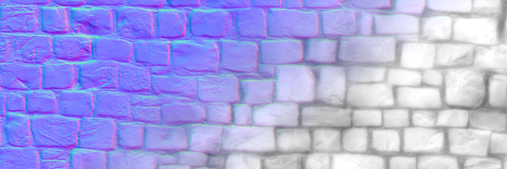

# NormalHeight
 
NormalHeight is a Blender add-on to compute depth from normal maps. 
It uses the Frankot-Chellappa depth-from-gradient algorithm. It can 
be used in conjunction with [DeepBump](https://github.com/HugoTini/DeepBump)
to produce height maps from single pictures.

# Installation

[Download the repo as a ZIP](https://github.com/HugoTini/NormalHeight/archive/master.zip),
then in Blender go to _Edit -> Preferences -> Add-ons -> Install_ and select the 
downloaded ZIP file. Then enable the add-on.

# Usage

In the Shader Editor, select a normal map _Image Texture Node_ and click _Generate Height Map_ in the right panel under the _NormalHeight_ tab.